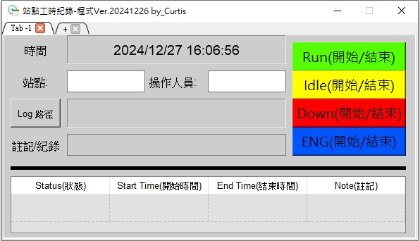

# Project name:Workstation-time recording program 
## 
###  Use code:           Python+PYQT5
###  Overview:           Program for recording work time
###  Requirements:       (Windows env.)Directly execute .exe file
###  Usage:
        a.  Enter workstation and operator name
        b.  select save log path
        c.  Write note as needed (can be empty)
        d.  Click buttons as needed and save to .csv file.
        e.  Output a TimeLog.csv file.
###  Useful Resources(Demo)-as attached

## Authors

- [CurtisTz@github](https://github.com/CurtisTz)

## Support

For support, email iiscurtis@hotmail.com.

## Demo

<video controls width="640" height="360">
  <source src="Demo-Ver.20241226 by_Curtis.mp4" type="video/mp4">
  Your browser does not support the video tag.
</video>

## Change Log
#### [Ver1.0]-2024-11-25
##### [initial version]
#### [Ver1.1]-2024-1226
##### [Added]
- a.support Supports multi-site use.
- b.supports Chinese/English.
- c.adjust GUI layout.
- d.Notes can be recorded.
- e.Use the station and operator name as the csv file name.